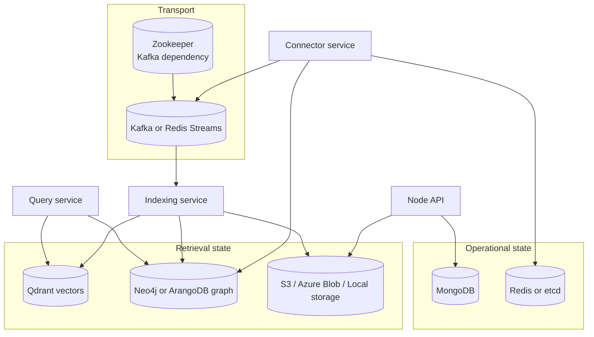
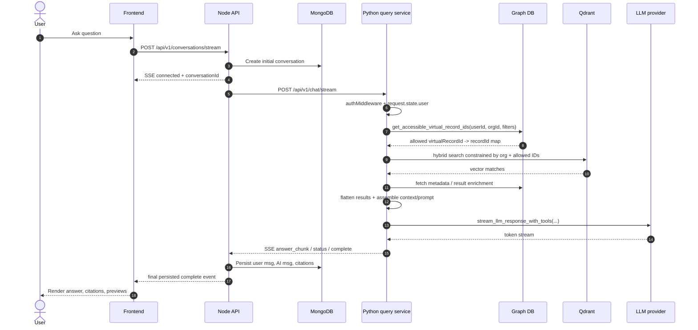
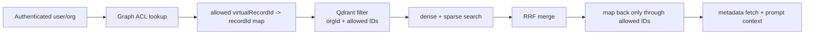
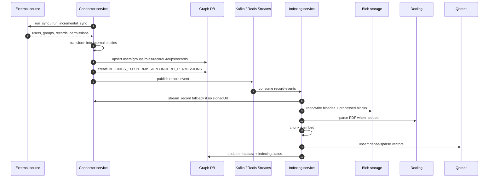
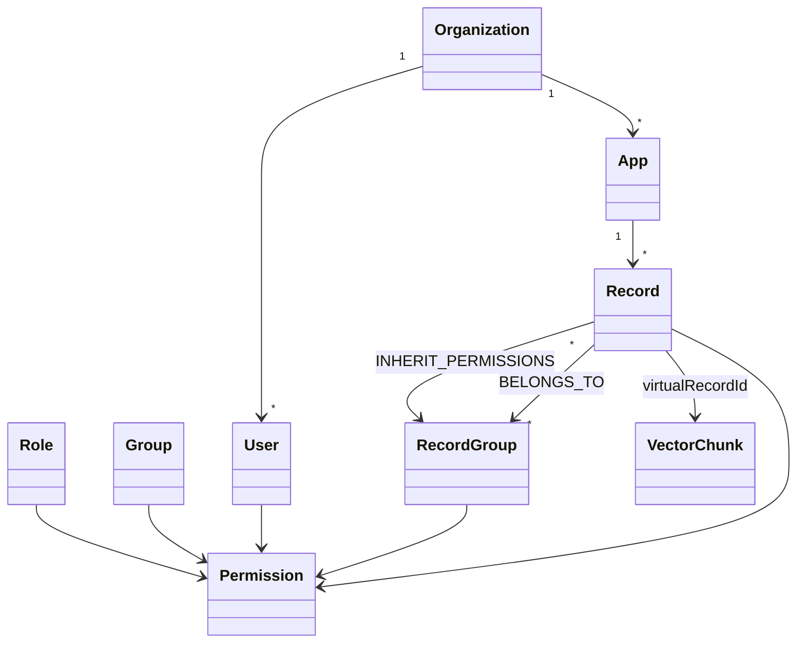
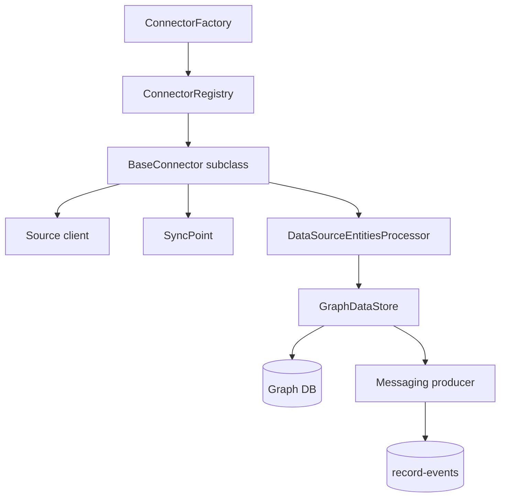
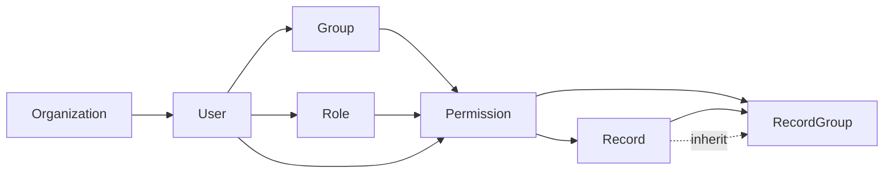
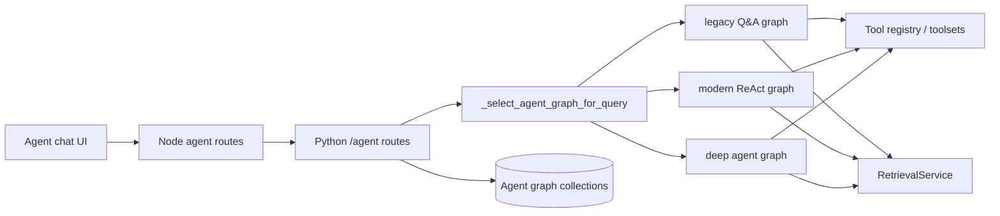
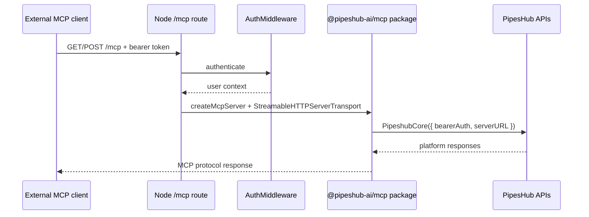

# PipesHub AI - Developer Architecture Deep Dive

> A slide-ready presentation for developers who need to extend the platform safely: add connectors, debug retrieval, reason about agents, and understand where MCP/SDK boundaries really are.
>
> **Evidence rule used throughout:** every concrete claim below is grounded in this repository. If the codebase does not prove something, it is explicitly marked **Not confirmed from code**.

---

## 0. Source map first: what was inspected

| Area | Primary source anchors |
|---|---|
| Product + deployment | `README.md`, `deployment/docker-compose/**`, `deployment/docker-compose/env.template` |
| Node API | `backend/nodejs/apps/src/index.ts`, `backend/nodejs/apps/src/app.ts` |
| Python services | `backend/python/app/connectors_main.py`, `query_main.py`, `indexing_main.py`, `docling_main.py` |
| Retrieval/chat | `backend/python/app/api/routes/chatbot.py`, `search.py`, `modules/retrieval/retrieval_service.py`, `utils/streaming.py` |
| Connectors | `backend/python/app/connectors/core/**`, `backend/python/app/connectors/sources/**` |
| Indexing | `backend/python/app/services/messaging/**`, `events/events.py`, `modules/transformers/**` |
| Permissions/graph | `backend/python/app/models/entities.py`, `models/permission.py`, `services/graph_db/**`, `config/constants/{arangodb,neo4j}.py` |
| Agents | `backend/python/app/api/routes/agent.py`, `modules/agents/**`, `agents/tools/**`, `agents/registry/**` |
| MCP | `backend/nodejs/apps/src/modules/mcp/**`, `backend/nodejs/apps/package.json` |
| SDK references | `README.md`, `backend/nodejs/apps/package.json` |
| Frontend | `frontend/app/(main)/chat/**`, `frontend/app/(main)/workspace/**`, `frontend/app/components/ui/ConnectorIcon.tsx` |
| Tests | `backend/python/tests/**`, `backend/nodejs/apps/tests/**`, `frontend/tests/e2e/**`, `integration-tests/**` |

### Repository shape

```text
Sada-AI-beta/
|--- backend/
|   |--- nodejs/apps/        # Express API, Mongo-backed app services, MCP adapter
|   `--- python/app/         # Connectors, query/RAG, indexing, docling, agents
|--- frontend/               # Next.js app router UI
|--- deployment/             # Docker Compose, Helm, env templates
|--- integration-tests/      # Cross-service integration suites
`--- docs/                   # Documentation
```

---

## 1. What the product is

### PipesHub in one sentence

A self-hosted workplace AI platform that ingests enterprise data from connectors, preserves source permissions in a graph, makes the data searchable through hybrid retrieval, and serves cited answers through chat, agents, APIs, and MCP.

### Main user flows

| Flow | What the user sees | What the system does |
|---|---|---|
| Connect a source | Add Jira/Drive/Slack/etc. | Store config, sync entities, permissions, records |
| Ask a question | Chat with citations | Permission-filtered retrieval -> prompt assembly -> streamed LLM answer |
| Browse knowledge | Knowledge Base UI | Graph-backed hierarchy + document metadata |
| Use an agent | Agent-specific chat | LangGraph runtime + tools + retrieval + conversation persistence |
| Integrate externally | API / MCP / SDK | Authenticated access to platform capabilities |

### Problems it solves

- Enterprise data is fragmented across systems.
- Naive RAG leaks data if it ignores source permissions.
- Answers are hard to trust without citations and source context.
- Automation needs tools, not only text generation.

---

## 2. The whole system at a glance

```mermaid
flowchart LR
  U[Developer / End user] --> FE[Frontend<br/>Next.js]
  FE --> API[Node.js API<br/>Express]

  API --> MONGO[(MongoDB)]
  API --> MCP[MCP HTTP adapter]
  API --> STORAGE[Object / blob storage<br/>S3 | Azure | Local]

  API --> QUERY[Python query service<br/>FastAPI]
  API --> CONNECTOR[Python connector service<br/>FastAPI]

  CONNECTOR --> GRAPH[(Neo4j or ArangoDB)]
  CONNECTOR --> KV[(Redis or etcd)]
  CONNECTOR --> BUS[(Kafka or Redis Streams)]

  BUS --> INDEX[Python indexing service]
  INDEX --> DOCLING[Docling PDF service]
  INDEX --> QDRANT[(Qdrant)]
  INDEX --> GRAPH
  INDEX --> STORAGE

  QUERY --> GRAPH
  QUERY --> QDRANT
  QUERY --> LLM[Configured LLM provider]
  QUERY --> BUS

  MCP --> EXT[External MCP clients]
  QUERY --> AGENT[Agent runtime<br/>LangGraph]
  AGENT --> GRAPH
  AGENT --> QUERY
```

### The practical mental model

```text
external data
   v
connectors normalize it
   v
graph stores ownership + permissions
   v
indexing turns content into vectors/blocks
   v
retrieval only searches what the user may access
   v
chat or agents turn retrieved context into answers
```

---

## 3. Monorepo and service map

### Major services

| Service | Entry point | Responsibility | Key routes / modules |
|---|---|---|---|
| Frontend | `frontend/app/**` | UI for chat, connectors, workspace, KB, agents | `frontend/app/(main)/chat/**`, `workspace/connectors/**` |
| Node API | `backend/nodejs/apps/src/index.ts` -> `app.ts` | Browser/API facade, auth, Mongo persistence, SSE relay, MCP adapter | `/api/v1/*`, `/mcp`, `/.well-known` |
| Connector service | `backend/python/app/connectors_main.py` | Source sync, OAuth/config, graph writes, record streaming | `app/connectors/api/router.py` |
| Query/RAG service | `backend/python/app/query_main.py` | Search, chat, agent endpoints, retrieval, LLM streaming | `api/routes/search.py`, `chatbot.py`, `agent.py` |
| Indexing service | `backend/python/app/indexing_main.py` | Consumes record events and builds searchable artifacts | `services/messaging/**`, `modules/transformers/**` |
| Docling service | `backend/python/app/docling_main.py` | PDF parsing/block creation | `services/docling/docling_service.py` |
| Agent runtime | Query service modules | Planning/tool execution/memory around chat | `modules/agents/**`, `agents/tools/**` |
| MCP integration | Node API module | HTTP bridge to imported MCP server package | `modules/mcp/**` |
| SDKs | External references only | Client libraries | **Not implemented in this repo** |

### Node route mounts

From `backend/nodejs/apps/src/app.ts`:

| Mount | Purpose |
|---|---|
| `/api/v1/chat`, `/api/v1/conversations`, `/api/v1/agents`, `/api/v1/search` | chat/search/agent UI APIs |
| `/api/v1/connectors`, `/api/v1/oauth`, `/api/v1/oauth2`, `/api/v1/oauth-clients` | connector + auth integration APIs |
| `/api/v1/document`, `/api/v1/knowledgeBase` | document/KB APIs |
| `/api/v1/users`, `/teams`, `/userGroups`, `/org` | IAM/org |
| `/api/v1/configurationManager`, `/toolsets`, `/mail`, `/crawlingManager` | platform services |
| `/mcp` | MCP HTTP endpoint |
| `/.well-known` | discovery metadata |

### Selected service endpoints developers actually touch

| Service | Endpoint | Code |
|---|---|---|
| Node conversations | `POST /api/v1/conversations/stream` | `enterprise_search/routes/es.routes.ts` |
| Node conversations | `POST /api/v1/conversations/:conversationId/messages/stream` | same |
| Node search | `POST /api/v1/search/` | same |
| Python search | `POST /search` | `backend/python/app/api/routes/search.py` |
| Python chat | `POST /chat/stream` | `backend/python/app/api/routes/chatbot.py` |
| Python agents | `POST /agent-chat`, `POST /agent-chat-stream`, `POST /{agent_id}/chat/stream` | `backend/python/app/api/routes/agent.py` |
| Python connectors | `GET /api/v1/connectors/registry`, `POST /api/v1/connectors/`, `GET /api/v1/stream/record/{record_id}`, `POST /api/v1/records/{record_id}/reindex` | `backend/python/app/connectors/api/router.py` |
| Docling | `POST /process-pdf`, `POST /parse-pdf`, `POST /create-blocks` | `backend/python/app/services/docling/docling_service.py` |
| MCP | `GET /mcp`, `POST /mcp` | `backend/nodejs/apps/src/modules/mcp/routes/mcp.routes.ts` |

---

## 4. Infrastructure and storage map



### What each component is for

| Component | Stores | Writers | Readers | When used | Why it exists |
|---|---|---|---|---|---|
| MongoDB | Conversations, agent conversations, users/org-facing app state, OAuth/app state, document metadata, citations, searches | Node API | Node API | CRUD + chat persistence | Transactional application state |
| Qdrant | Dense/sparse vectors in collection `records` | Indexing service | Query/RAG service | Semantic + hybrid retrieval | Fast similarity search |
| Neo4j **or** ArangoDB | Records, record groups, users, groups, roles, orgs, apps, permissions, metadata, agent graph | Connector service, indexing, agent APIs | Connector, query, indexing, agent APIs | Permissions, hierarchy, metadata, accessibility | Graph traversal + ACL modeling |
| Redis | KV store option; Redis Streams broker option | Config/messaging services | Python + Node services | Config, pub/sub, queueing depending on env | Lightweight shared state / transport |
| etcd | KV store option | Config services | Python + Node services | When `KV_STORE_TYPE=etcd` | Production-style distributed config |
| Kafka | Event transport: `record-events`, `entity-events`, `ai-config-events`, `sync-events`, `health-check` | Connector/query services | Indexing/query/connector consumers | Async ingest and config updates | Durable decoupling |
| Object/blob storage | Source binaries, transformed blocks, reconciliation metadata; providers: S3, Azure, local | Node storage module, Python `BlobStorage` transformer | Node + indexing/query-adjacent services | File ingest and parsed artifact reuse | Avoid stuffing blobs into DBs |
| Zookeeper | Kafka coordination only | Kafka stack | Kafka | Kafka deployments | Infra dependency, not business data |
| Sandbox image | Agent code execution environment | Agent runtime | Agent runtime | Only when sandbox mode uses Docker | Isolated execution |

### Exact code anchors

- Node storage providers: `backend/nodejs/apps/src/modules/storage/providers/{s3,azure,local-storage}.provider.ts`
- Python blob transformer: `backend/python/app/modules/transformers/blob_storage.py`
- Graph collection names: `backend/python/app/config/constants/arangodb.py`
- Qdrant collection constant: `QdrantCollectionNames.RECORDS = "records"`
- Deployment choices: `deployment/docker-compose/docker-compose.build.{neo4j,arango}.yml`

### Collections you will see in practice

| Store | Exact names confirmed from code |
|---|---|
| MongoDB | `conversations`, `agentConversations`, `search`, `citation`, plus explicit models such as `users`, `org`, `org-logos`; many others are defined through Mongoose schemas under `backend/nodejs/apps/src/modules/**/schema/**` |
| ArangoDB graph | `records`, `recordGroups`, `syncPoints`, `permission`, `belongsTo`, `inheritPermissions`, `users`, `groups`, `roles`, `organizations`, `apps`, `files`, `tickets`, `projects`, `prs`, `blocks`, `agentTemplates`, `agentInstances`, `agentKnowledge`, `agentToolsets`, `agentTools` |
| Neo4j graph | Equivalent concepts are mapped to labels/relationship types in `backend/python/app/config/constants/neo4j.py` |
| Qdrant | `records` |

> **Note:** the enterprise-search module currently contains two citation schema files, one modeling `citation` and one modeling `citations`. The active controller import path is `enterprise_search/schema/citation.schema.ts`; the duplicate schema location is a maintenance gotcha.

---

## 5. End-to-end chat and retrieval flow

### Normal chat request path



### Exact code path

| Stage | Code |
|---|---|
| Frontend request | `frontend/app/(main)/chat/api.ts#streamMessage` |
| Frontend SSE handling | `frontend/app/(main)/chat/streaming.ts` |
| Node new-conversation stream | `backend/nodejs/apps/src/modules/enterprise_search/routes/es.routes.ts`, `controller/es_controller.ts#streamChat` |
| Python route | `backend/python/app/api/routes/chatbot.py#stream_chat` and `_generate_internal_search_stream` |
| Permission gate | `RetrievalService.search_with_filters()` -> graph provider `get_accessible_virtual_record_ids()` |
| Hybrid retrieval | `backend/python/app/modules/retrieval/retrieval_service.py#_execute_parallel_searches` |
| LLM streaming | `backend/python/app/utils/streaming.py#stream_llm_response_with_tools` |
| Conversation persistence | `saveCompleteConversation(...)` in Node enterprise-search utils |
| Citation rendering | `frontend/app/(main)/chat/components/message-area/response-tabs/citations/**` |

### Chat request payload: confirmed shape, illustrative values

```json
{
  "query": "What did the Jira team decide about SSOc",
  "previousConversations": [],
  "filters": {"apps": ["jira"]},
  "retrievalMode": "HYBRID",
  "chatMode": "auto",
  "tools": [],
  "modelKey": "...",
  "timezone": "Asia/Jerusalem",
  "currentTime": "2026-05-15T10:00:00+03:00"
}
```

### Retrieval internals developers should remember



- The **graph decides eligibility first**; Qdrant is not asked to search the whole corpus.
- Qdrant returns `virtualRecordId`s; code resolves them only through the graph-returned allowed map, which blocks cross-connector leakage when virtual IDs collide.
- `_generate_internal_search_stream()` also calls `enrich_virtual_record_id_to_result_with_fk_children(...)`; this is the concrete graph-backed enrichment visible in the normal chat path.
- If no accessible IDs exist, the retrieval service returns `ACCESSIBLE_RECORDS_NOT_FOUND`; inaccessible documents are not searched or returned.

---

## 6. Indexing pipeline: how external data becomes searchable



### Message topology

| Topic | Consumer intent | Source |
|---|---|---|
| `record-events` | New/update/reindex/delete records | Connector graph writes |
| `entity-events` | Entity synchronization | Connector service |
| `ai-config-events` | Model/config refresh | Query service consumes |
| `sync-events` | Sync lifecycle | Connector-side consumers |
| `health-check` | Messaging health | Shared infra |

Exact definitions: `backend/python/app/services/messaging/config.py`

Record event names confirmed in `backend/python/app/config/constants/arangodb.py` and consumed by `RecordEventHandler`:

- `newRecord`
- `updateRecord`
- `reindexRecord`
- `deleteRecord`
- `bulkDeleteRecords`

Indexing lifecycle events confirmed in `backend/python/app/services/messaging/config.py`:

- `parsing_complete`
- `indexing_complete`
- `docling_failed`

### Record event shape: confirmed fields, illustrative values

```json
{
  "eventType": "newRecord",
  "payload": {
    "recordId": "record_123",
    "recordName": "SSO rollout plan",
    "orgId": "org_1",
    "version": 0,
    "connectorName": "jira",
    "extension": "md",
    "mimeType": "text/markdown",
    "origin": "CONNECTOR",
    "recordType": "ticket",
    "virtualRecordId": "jira_issue_42"
  }
}
```

Handled by `backend/python/app/services/messaging/kafka/handlers/record.py#RecordEventHandler.process_event`.

### Current indexing stack

| Phase | Code |
|---|---|
| Consume event | `services/messaging/kafka/handlers/record.py` |
| Dedupe + event orchestration | `events/events.py#EventProcessor` |
| Extract | `modules/transformers/document_extraction.py` |
| Orchestrate sinks | `modules/transformers/sink_orchestrator.py` |
| Blob sink | `modules/transformers/blob_storage.py` |
| Vector sink | `modules/transformers/vectorstore.py` |
| Graph sink | `modules/transformers/graphdb.py` |
| PDF service | `services/docling/docling_service.py` |

> **Gotcha:** the repo contains two classes named `IndexingPipeline`: `modules/indexing/run.py` and `modules/transformers/pipeline.py`. Current container wiring points at the transformer pipeline. Treat the duplicate name as a maintenance hazard.

### Data model skeleton



Relevant model anchors:

- `backend/python/app/models/entities.py`: `Record`, `FileRecord`, `TicketRecord`, `RecordGroup`, `AppUser`, `AppUserGroup`, `AppRole`, `AppMetadata`
- `backend/python/app/models/permission.py`: `Permission`, `PermissionType`, `EntityType`

---

## 7. Connector architecture

### Connector framework



### Core abstractions

| Concern | Exact code |
|---|---|
| Base class | `backend/python/app/connectors/core/base/connector/connector_service.py#BaseConnector` |
| Factory | `backend/python/app/connectors/core/factory/connector_factory.py#ConnectorFactory` |
| Registry decorator + metadata | `backend/python/app/connectors/core/registry/connector_registry.py` |
| Sync checkpoints | `backend/python/app/connectors/core/base/sync_point/sync_point.py#SyncPoint` |
| Entity processor | `backend/python/app/connectors/core/base/data_processor/data_source_entities_processor.py#DataSourceEntitiesProcessor` |
| Graph write adapter | `backend/python/app/connectors/core/base/data_store/graph_data_store.py#GraphDataStore` |
| Connector APIs | `backend/python/app/connectors/api/router.py` |

### What `BaseConnector` expects a connector to implement

- `init`
- `test_connection_and_access`
- `get_signed_url`
- `stream_record`
- `run_sync`
- `run_incremental_sync`
- `handle_webhook_notification`
- `cleanup`
- `reindex_records`
- optional config/filter helpers

### Jira as the main example

| Concern | Exact implementation |
|---|---|
| Connector class | `backend/python/app/connectors/sources/atlassian/jira_cloud/connector.py#JiraConnector` |
| Constructor sync point | same file: `issues_sync_point = SyncPoint(...)` |
| Initial sync | `run_sync()` |
| Incremental sync | `run_incremental_sync()` |
| Rehydrate a record | `stream_record()` |
| Reindex support | `reindex_records()` |
| Permission extraction | Jira permission-scheme logic in same connector; project-level permissions are inherited by issues |

### From zero to a new connector

| Step | Do this | Why |
|---|---|---|
| 1 | Create a source folder under `backend/python/app/connectors/sources/<vendor>/<product>/` | Keeps source-specific code isolated |
| 2 | Subclass `BaseConnector` and register it with connector metadata | Gives factory/registry a discoverable implementation |
| 3 | Add or verify factory inclusion in `ConnectorFactory._connector_registry` or beta definitions | Makes it constructible at runtime |
| 4 | Store config/OAuth via `ConfigurationService`-backed connector paths | Prevents credential sprawl |
| 5 | Use `SyncPoint` for high-water marks | Makes incremental sync resumable |
| 6 | Transform source data into internal `Record`, `RecordGroup`, `AppUser`, `AppUserGroup`, `AppRole`, `Permission` models | Aligns source semantics with retrieval + ACLs |
| 7 | Use `DataSourceEntitiesProcessor` / `GraphDataStore` writes | Ensures graph edges and event publishing happen consistently |
| 8 | Implement `stream_record()` | Lets indexing recover content later or reindex on demand |
| 9 | Add frontend icon/config | Use `frontend/app/components/ui/ConnectorIcon.tsx` and connector workspace UI |
| 10 | Add tests | Unit + integration + permission cases |

### Connector credentials and sync points

- Sync checkpoint key format is built by `SyncPoint` as `{org_id}/{connector_id}/{type}/{key}` and encrypted with `SECRET_KEY`.
- Connector configuration is accessed through `ConfigurationService` paths in connector code; exact persistence backend depends on `KV_STORE_TYPE` (`redis` or `etcd`).
- **Not confirmed from code:** a single universal storage schema for every connector credential; connector implementations may use source-specific config paths.
- Standard graph-write flows publish `record-events`, which is the normal way new connector content reaches indexing.
- For an explicit developer-triggered reindex, the connector API exposes `POST /api/v1/records/{record_id}/reindex`.

### Frontend integration anchors

- Workspace pages: `frontend/app/(main)/workspace/connectors/**`
- Icon mapping: `frontend/app/components/ui/ConnectorIcon.tsx`
- Mock registry fixture used by UI/dev: `frontend/app/mock-data/connectors/registry.json`
- Reindex/content routes connectors must support downstream: `GET /api/v1/stream/record/{record_id}`, `POST /api/v1/records/{record_id}/reindex`

---

## 8. Permission-aware search



### Permission model

| Concept | Exact code |
|---|---|
| Permission types | `PermissionType`: `READER`, `WRITER`, `OWNER`, `COMMENTER`, `OTHERS` |
| Entity types | `EntityType`: `USER`, `GROUP`, `ROLE`, `DOMAIN`, `ORG`, `TEAM`, `ANYONE`, `ANYONE_WITH_LINK` |
| Record/group handling | `DataSourceEntitiesProcessor._handle_record_permissions`, `on_new_record_groups`, `_link_record_to_group` |
| Graph writes | `GraphDataStore.batch_upsert_record_permissions`, `batch_upsert_record_group_permissions`, `create_inherit_permissions_relation_record_group` |
| Retrieval gate | Graph provider `get_accessible_virtual_record_ids` in both Neo4j and Arango providers |

### Inheritance

- A record can inherit from a record group when `record.inherit_permissions` is true.
- A record group can inherit from another record group.
- Connectors should model source permissions as internal `Permission` objects, then declare inheritance rather than duplicating permissions blindly.

### Why unauthorized data stays dark

1. Query service resolves user + org from auth context.
2. Graph provider computes only the virtual record IDs the user may access.
3. Qdrant search is constrained to those IDs and the org.
4. Returned vectors are mapped back only through the allowed virtual-ID map.
5. If no IDs are accessible, retrieval stops before useful context exists.

### If a user asks about forbidden data

The code path does **not** retrieve forbidden records. The exact user-facing wording is not guaranteed by the architecture layer, but the retrieval service exposes an `ACCESSIBLE_RECORDS_NOT_FOUND` path rather than leaking hidden content.

---

## 9. Agent architecture

### What an agent is here

An agent is a graph-backed runtime configuration plus a LangGraph execution path that can retrieve context, call tools, reason in multiple tiers, and persist a separate agent conversation stream.



### Exact files

| Concern | Code |
|---|---|
| Routes + graph selection | `backend/python/app/api/routes/agent.py` |
| Q&A graphs | `backend/python/app/modules/agents/qna/graph.py` |
| Deep graph | `backend/python/app/modules/agents/deep/graph.py` |
| State | `backend/python/app/modules/agents/qna/chat_state.py` |
| Memory hygiene | `backend/python/app/modules/agents/qna/memory_optimizer.py` |
| Tool decorator | `backend/python/app/agents/tools/decorator.py` |
| Tool registry | `backend/python/app/agents/tools/registry.py` |
| Toolset registry | `backend/python/app/agents/registry/toolset_registry.py` |
| New-tool guide | `backend/python/app/agents/tools/ADDING_NEW_TOOLS.md` |

### Agent routes you will actually see

| Layer | Route examples |
|---|---|
| Node facade | `POST /api/v1/agents/:agentKey/conversations/stream`, `POST /api/v1/agents/:agentKey/conversations/:conversationId/messages/stream` |
| Python generic agent execution | `POST /agent-chat`, `POST /agent-chat-stream` |
| Python configured agent instances | `POST /{agent_id}/chat`, `POST /{agent_id}/chat/stream` |
| Builder/admin | `POST /template/create`, `GET /template/list`, `POST /create`, `GET /{agent_id}`, `PUT /{agent_id}/permissions` |

### Agent graph collections

Defined in `backend/python/app/config/constants/arangodb.py`:

- `agentTemplates`
- `agentInstances`
- `agentKnowledge`
- `agentToolsets`
- `agentTools`
- `agentHasKnowledge`
- `agentHasToolset`
- `toolsetHasTool`

### How agent chat differs from normal chat

| Normal chat | Agent chat |
|---|---|
| Frontend calls conversation stream APIs | Frontend calls agent-specific stream APIs when `agentId` exists |
| Node stores in `conversations` | Node stores in `agentConversations` |
| Query route: `/api/v1/chat/stream` | Python route family: `/agent/.../chat/stream` |
| Retrieval + optional tools inside chatbot route | LangGraph orchestration, tool loops, route selection, memory optimization |

### How to add a new agent tool

1. Implement the action under `backend/python/app/agents/actions/**`.
2. Decorate/register the callable with the agent tool system.
3. Add or update the enclosing toolset registry entry.
4. Expose tool metadata/config requirements.
5. Test execution, auth/config access, and streaming behavior through an agent route.

### Tool use + connectors

- Agent routes initialize toolset registries during query-service startup.
- `ChatState` carries toolset configs and a `tool_to_toolset_map`.
- Agents can use retrieval and configured toolsets/connectors when supported by their runtime configuration.
- `build_initial_state(...)` creates the working state; `auto_optimize_state(...)` and `check_memory_health(...)` keep long-running agent context bounded.
- `_select_agent_graph_for_query(...)` routes `quick`, `react`, and `deep` work into different LangGraph paths.
- **Not confirmed from code:** agents invoking MCP tools directly as first-class local tools. The repo proves agents, tools, and MCP exist; it does not prove a direct internal MCP bridge.
- **Not confirmed from code:** agents calling the external SDKs directly. The local code clearly supports toolsets/connectors and retrieval; SDK implementations are external.

---

## 10. MCP architecture

### What this repo actually contains



### Confirmed code

| Concern | Exact file |
|---|---|
| Route mount | `backend/nodejs/apps/src/app.ts` |
| Route handlers | `backend/nodejs/apps/src/modules/mcp/routes/mcp.routes.ts` |
| Controller | `backend/nodejs/apps/src/modules/mcp/controller/mcp.controller.ts` |
| Dependencies | `@modelcontextprotocol/sdk`, `@pipeshub-ai/mcp` in `backend/nodejs/apps/package.json` |

### What is local vs external

| Local in this repo | External / imported |
|---|---|
| Authenticated `/mcp` HTTP bridge | Actual MCP server/tool implementation from `@pipeshub-ai/mcp` |
| `StreamableHTTPServerTransport` wiring | External package internals |
| Passing bearer token + server URL into `PipeshubCore` | README-linked standalone MCP repo |

### Adding an MCP tool

- **Not confirmed from code:** a local path for adding a brand-new MCP tool inside this repo.
- Based on imports, new MCP tool definitions likely belong in the external `@pipeshub-ai/mcp` package / standalone MCP repo, while this repo owns the adapter and authentication envelope.

### Auth and permissions

- `/mcp` routes use the same Node auth middleware as the rest of the API.
- The controller passes the caller's bearer token into `PipeshubCore`; downstream API calls therefore execute in caller context.
- Fine-grained tool authorization beyond that is **not confirmed from this repo** because the actual tool server lives outside it.

---

## 11. SDK architecture

### Confirmed SDK references

The root `README.md` links to external SDK repositories for:

- Python SDK
- TypeScript SDK
- Go SDK

### What this repo can and cannot tell you

| Question | Answer from this repo |
|---|---|
| Which SDKs exist? | Python, TypeScript, and Go SDK repos are referenced in `README.md` |
| What are they used for? | External integration with platform APIs is implied by the README links; exact use cases are **Not confirmed from code** |
| How do they authenticate? | **Not confirmed from code**; SDK implementations are external |
| Which APIs do they wrap? | **Not confirmed from code**; inspect the external SDK repos |
| How would a developer use one? | From this repo alone: call the server APIs directly or consult the external SDK repos for client examples |

### What is inside this repo

| Present locally | Not present locally |
|---|---|
| API surfaces the SDKs would call | SDK source implementations |
| MCP adapter importing `PipeshubCore` from external package | SDK auth helpers, client classes, examples |

### Practical conclusion

- Use this repo to understand **server APIs and auth expectations**.
- Use the external SDK repos to understand **client ergonomics and exact SDK method names**.
- **Not confirmed from code:** the full public SDK surface, exact authentication helpers, or version parity across SDKs.

---

## 12. Developer extension guide

### Add something safely

| Goal | Inspect first | Change next | Main risk | Test command(s) | Expected result |
|---|---|---|---|---|---|
| New connector | `connectors/core/**`, one sibling source, Jira example | new source module, registry/factory, UI icon/config | ACL mismatch; bad sync checkpoints | `cd backend/python && pytest`; `cd integration-tests && pytest -m integration -v` | Records appear, permissions hold, indexing fires |
| Retrieval filter | `retrieval_service.py`, graph providers | filter parsing + graph/Qdrant constraints | filter applied in one store but not the other | `cd backend/python && pytest` | Search narrows without leaks |
| Chat mode | `chatbot.py`, frontend chat types, Node controller | request schema + mode branch + UI | stream contract drift | `cd backend/python && pytest`; `cd backend/nodejs/apps && npm test`; `cd frontend && npm run test:e2e` | mode routes and streams correctly |
| Agent tool | `agents/tools/**`, `agents/actions/**` | action + registry/toolset metadata | hidden side effects; missing auth | `cd backend/python && pytest` | tool appears and executes in agent flow |
| MCP tool | `modules/mcp/**` | likely external package, not local repo | false assumption that local adapter owns tools | **Not confirmed locally** | **Not confirmed locally** |
| Frontend page | `frontend/app/(main)/**`, `workspace/sidebar/index.tsx` if navigated | new page route + optional nav entry | orphaned route / i18n gap | `cd frontend && npm run test:e2e` | page loads through app shell |
| Backend API route | `app.ts`, nearest module route/controller | route + controller + validation/auth | missing middleware/scopes | `cd backend/nodejs/apps && npm test` | route mounted and authorized |
| Database model | nearest Mongoose schema or Python graph model | schema/model + read/write paths + migrations if needed | dual-store drift | `cd backend/nodejs/apps && npm test` and/or `cd backend/python && pytest` | new data persists and reads back |
| Kafka event | `services/messaging/config.py`, handlers | event enum + producer + consumer | producer/consumer schema divergence | `cd backend/python && pytest` | event is consumed end-to-end |
| Parser/file type | `RecordEventHandler`, parser modules, transformer pipeline | MIME/extension support + parser | indexing partial failures | `cd backend/python && pytest` | content lands in Qdrant + graph |
| Tests | existing test folders | add nearest-level coverage | only happy path covered | see testing slide | regression caught where it lives |

### A few concrete recipes

#### Add a new connector

```text
1. Copy the shape of Jira or another close sibling.
2. Define source auth/config and `SyncPoint`s.
3. Normalize source entities into internal models.
4. Write graph edges through `DataSourceEntitiesProcessor`.
5. Ensure `stream_record()` can rehydrate content later.
6. Prove sync, incremental sync, delete/update, and permissions before polishing UI.
```

#### Add a new retrieval filter

```text
1. Add request acceptance in frontend / Node if user-facing.
2. Apply it in graph accessibility lookup.
3. Apply equivalent constraints in Qdrant metadata filters.
4. Add negative tests for data the user must not see.
```

#### Add a new document parser

```text
1. Extend accepted MIME/extension handling in `RecordEventHandler`.
2. Implement parser/extractor path in Python modules.
3. Feed standard blocks into transformer sinks.
4. Validate citations and previews, not only embedding success.
```

---

## 13. Local development and debugging

### Local topology

| Component | Default / documented port |
|---|---|
| Node API | `3000` |
| Frontend dev server | `3001` |
| Query service | `8000` |
| Connector service | `8088` |
| Indexing service | `8091` |
| Docling service | `8081` |

### Required services in the bundled Compose topology

- Always present: `pipeshub-ai`, MongoDB, Redis, Qdrant, one graph backend, sandbox image.
- Graph choice: Neo4j **or** ArangoDB.
- Arango build also includes etcd.
- Kafka and Zookeeper are optional, enabled through the Kafka profile; Redis Streams is the alternate broker path.

### Compose entry points

| Use case | File |
|---|---|
| Build with Neo4j | `deployment/docker-compose/docker-compose.build.neo4j.yml` |
| Build with ArangoDB | `deployment/docker-compose/docker-compose.build.arango.yml` |
| Hot reload variants | `deployment/docker-compose/hot-reload/docker-compose.dev.{neo4j,arango}.yml` |
| Env reference | `deployment/docker-compose/env.template` |

### Commands confirmed in the repo docs

```bash
# Production-style startup
cd deployment/docker-compose
docker compose -f docker-compose.prod.yml -p pipeshub-ai up -d

# Local build with Neo4j
cd deployment/docker-compose
docker compose -f docker-compose.build.neo4j.yml -p pipeshub-ai up --build -d
```

### Important env switches

| Env var | Meaning |
|---|---|
| `GRAPH_DB_TYPE`, `DATA_STORE` | Neo4j vs ArangoDB selection |
| `KV_STORE_TYPE` | `redis` or `etcd` |
| `MESSAGE_BROKER` | `kafka` or `redis` |
| `MCP_SCOPES` | exposed MCP permission scopes |
| `SECRET_KEY` | encryption secret used by components such as sync-point key handling |
| `MONGO_URI`, `MONGO_DB_NAME` | Mongo connection + DB |
| `QDRANT_HOST`, `QDRANT_PORT`, `QDRANT_GRPC_PORT`, `QDRANT_API_KEY` | vector store connection |
| `NEO4J_*` or `ARANGO_*` | graph connection settings |
| `REDIS_*`, `ETCD_*`, `KAFKA_*` | KV/broker connection settings |
| `MAX_CONCURRENT_PARSING`, `MAX_CONCURRENT_INDEXING`, `MAX_PENDING_INDEXING_TASKS` | indexing throughput |
| `INDEXING_UVICORN_WORKERS`, `DOCLING_UVICORN_WORKERS` | service worker counts |
| `SANDBOX_MODE` | agent sandbox execution mode |

### Debugging playbook

| Symptom | Start here | Then inspect |
|---|---|---|
| Connector sync stalls | connector logs + source connector `run_sync()` | `SyncPoint`, graph records, source auth config |
| Records exist but are not searchable | `record-events` -> `RecordEventHandler` | graph `indexingStatus`, parser support, Qdrant vectors |
| PDF indexing fails | Docling health + `/parse-pdf` path | `docling_service.py`, PDF parser logs |
| User cannot find known data | `get_accessible_virtual_record_ids()` | source permissions, inheritance edges, filters |
| Chat streams but never saves | Node `es_controller.ts` | final `complete` SSE and Mongo persistence |
| Citations look wrong | Python streaming citation normalization | citation persistence + frontend citation components |
| Agent behaves unlike normal chat | `/agent` routes + graph selection | selected tier, toolset config, memory optimizer |

### Where logs appear

- Confirmed local/deployment view: `docker compose logs` / `docker compose logs -f pipeshub-ai`.
- The Neo4j compose variant mounts `neo4j_logs:/logs`.
- Node and Python services log through the app container process streams in the bundled Compose topology.
- **Not confirmed from code:** a stable per-service local logfile path for every service outside container stdout/stderr.

### Running and restarting

- README documents Compose-based startup; Python and Node services also have direct entry points.
- Build Compose variants run the application stack inside a single `pipeshub-ai` app container plus infra.
- **Not confirmed from code:** a first-party command that restarts only one internal Python service when using the bundled single-container build topology.
- In source-run workflows, restart the entry point you changed; in Compose, prefer the matching hot-reload dev file where possible.

### Resetting local data

- **Not confirmed from code:** a repo-provided safe reset script.
- If you reset volumes manually, treat it as destructive: back up first, then remove only the named local dev volumes you intend to recreate.

> Small but useful discrepancy: `frontend/README.md` documents a local API base URL that differs from the dev Compose value. Treat Compose/env files as deployment truth when they disagree with older prose docs.

---

## 14. Testing strategy

### Test surfaces

| Layer | Location | Commands confirmed from repo |
|---|---|---|
| Python unit | `backend/python/tests/**` | `pytest`, `pytest -v`, `pytest --cov=app --cov-report=term-missing` |
| Node unit/integration | `backend/nodejs/apps/tests/**` | `npm test`, `npm run test:coverage`, `npm run test:ci` |
| Frontend E2E | `frontend/tests/e2e/**` | `npm run test:e2e`, `npm run test:e2e:headed`, `npm run test:e2e:ui` |
| Cross-service integration | `integration-tests/**` | `pytest -m integration -v` plus connector markers |

### What to test by feature type

| Feature | Minimum tests |
|---|---|
| Connector | auth, initial sync, incremental sync, deletes/updates, checkpoints, permissions, `stream_record()` |
| Permissions | direct access, inherited access, no access, group access, role access, cross-org isolation |
| Retrieval | dense + sparse, filters, no-access path, vector->graph reconciliation |
| Citations | generated IDs, persisted citations, UI preview/highlight path, hallucinated URL handling |
| Indexing | supported file type, unsupported file type, md5 dedupe, reindex, docling failure |
| Agent | route selection, retrieval, tool success/failure, memory pruning, conversation persistence |

### Manual full-system checklist

```text
[ ] Add a connector instance
[ ] Complete initial sync
[ ] Confirm graph nodes + permissions exist
[ ] Confirm record-events are published
[ ] Confirm Qdrant vectors appear
[ ] Ask an allowed question and see citations
[ ] Ask as a denied user and confirm no leakage
[ ] Reindex one record
[ ] Ask through an agent and confirm separate conversation persistence
[ ] Exercise one toolset-backed action
```

---

## 15. After this presentation, you should understand...

- **Where data enters:** connectors and KB/document ingestion.
- **Where it lives:** Mongo for app state, graph DB for identities/ACLs, Qdrant for vectors, blob storage for files/artifacts.
- **How it becomes searchable:** connector sync -> graph write -> record event -> parsing/chunking/embedding -> Qdrant + graph status.
- **How permissions are enforced:** graph ACL lookup happens before vector search and bounds every retrieval result.
- **How chat answers are produced:** Node SSE facade -> Python retrieval -> prompt/context assembly -> LLM stream -> citations + persistence.
- **How agents differ:** separate graph runtime, tool loops, memory handling, and conversation store.
- **How to add a connector:** extend `BaseConnector`, model permissions correctly, publish through the standard pipeline, then add UI/tests.
- **How to add features safely:** preserve auth, graph/Qdrant parity, event contracts, and negative permission tests.

---

# Appendix A - Glossary

| Term | Meaning in this codebase |
|---|---|
| `Record` | A normalized searchable entity from a connector or KB |
| `RecordGroup` | A container/project/folder-like grouping that may carry permissions |
| `virtualRecordId` | Source-facing identifier used to bridge vectors back to records |
| `SyncPoint` | Connector checkpoint for incremental sync |
| `BELONGS_TO` | Graph relation between record and group |
| `PERMISSION` | Graph relation granting an entity access |
| `INHERIT_PERMISSIONS` | Graph relation causing ACL inheritance |
| `Toolset` | Grouping of agent tools plus configuration |
| `Agent template / instance` | Reusable definition vs concrete configured agent |
| `Docling` | PDF parsing/block-generation microservice |
| `RRF` | Reciprocal-rank fusion of dense and sparse retrieval results |

---

# Appendix B - Key files by topic

| Topic | Files |
|---|---|
| Node startup + routes | `backend/nodejs/apps/src/index.ts`, `app.ts` |
| Chat API | `modules/enterprise_search/routes/es.routes.ts`, `controller/es_controller.ts` |
| Python chat | `api/routes/chatbot.py`, `utils/streaming.py` |
| Retrieval | `modules/retrieval/retrieval_service.py` |
| Connector framework | `connectors/core/base/**`, `factory/connector_factory.py`, `registry/connector_registry.py` |
| Jira example | `connectors/sources/atlassian/jira_cloud/connector.py` |
| Indexing | `services/messaging/**`, `events/events.py`, `modules/transformers/**` |
| Permissions | `models/permission.py`, `connectors/core/base/data_processor/data_source_entities_processor.py`, `services/graph_db/**` |
| Agents | `api/routes/agent.py`, `modules/agents/**`, `agents/tools/**` |
| MCP | `modules/mcp/routes/mcp.routes.ts`, `modules/mcp/controller/mcp.controller.ts` |
| Frontend chat | `frontend/app/(main)/chat/api.ts`, `streaming.ts` |
| Frontend connector UI | `frontend/app/(main)/workspace/connectors/**`, `frontend/app/components/ui/ConnectorIcon.tsx` |
| Deployment | `deployment/docker-compose/**`, `env.template` |

---

# Appendix C - Common debugging commands

```bash
# Compose logs for the app container
# (choose the compose file matching your graph backend)
docker compose -f deployment/docker-compose/docker-compose.build.neo4j.yml logs -f pipeshub-ai

# Search the codebase for a route or event
rg -n "chat/stream|record-events|newRecord" backend frontend

# Python unit tests
cd backend/python && pytest -v

# Node tests
cd backend/nodejs/apps && npm test

# Frontend E2E
cd frontend && npm run test:e2e

# Integration tests
cd integration-tests && pytest -m integration -v
```

---

# Appendix D - Common extension patterns

### Pattern 1: source-specific outside, normalized inside

```text
source API payload
   v connector-specific adapter
internal entities + permissions
   v shared processors
standard graph + event pipeline
```

### Pattern 2: apply every retrieval constraint twice

```text
graph accessibility filter
        +
Qdrant metadata/vector filter
        =
search that is both correct and safe
```

### Pattern 3: keep streaming contracts stable

```text
frontend SSE parser <-> Node relay <-> Python generator
```

If you change one side, inspect the other two before shipping.

---

# Appendix E - Architecture risks and gotchas

| Risk | Why it matters |
|---|---|
| Dual graph backends | Neo4j and Arango implementations must stay behaviorally aligned |
| Broker/KV switches | Redis vs Kafka and Redis vs etcd can change runtime behavior across environments |
| Two indexing pipeline classes | Easy to patch the wrong class |
| Duplicate citation schema locations | Increases confusion during maintenance |
| ACL inheritance mistakes | One bad connector mapping can create silent overexposure or underexposure |
| One-container app topology | Makes service boundaries less obvious during local debugging |
| External MCP implementation | Local edits may not add tools if the real server lives in the package |
| External SDKs | API assumptions can drift from client repos |
| Frontend documentation drift | Older prose docs may lag Compose/env truth |

### Final rule of thumb

When extending this platform, preserve the system's three invariants:

1. **Normalize once.** External weirdness belongs at the connector edge.
2. **Authorize before retrieve.** The graph is the gatekeeper, not the UI.
3. **Persist after truth.** Stream optimistically, but save only the completed result plus its normalized metadata.
